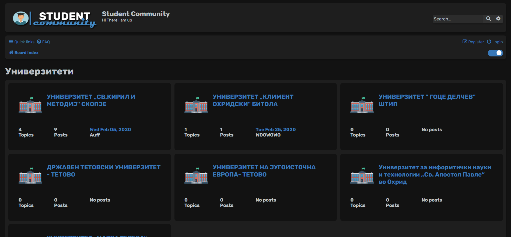

<!-- PROJECT LOGO -->
 

  

  <h3 align="center">Student Community</h3>

  

    Studdent forum for unis in macedonia
  

<!-- ABOUT THE PROJECT -->
## About The Project

Forums for students, as well as discussion or message boards and online communities are still the best way for high-school, college undergrad or grad school students to acquire and exchange useful knowledge and information about their studies, the student life, school orientation and everything in between.
 
It's based on phpBB and modified with a new theme and an macedoinan language pack.

### Built With

* [phpBB](https://www.phpbb.com/)
* [Bootstrap](https://getbootstrap.com)
* [JQuery](https://jquery.com)

<!-- LICENSE -->
## License

Distributed under the MIT License. See `LICENSE` for more information.

<!-- CONTACT -->
## Contact

Vase Trendafilov - [@TrendafilovVase](https://twitter.com/TrendafilovVase) - vasetrendafilov@gmail.com

Project Link: [https://github.com/vasetrendafilov/studentcommunity](https://github.com/vasetrendafilov/studentcommunity)